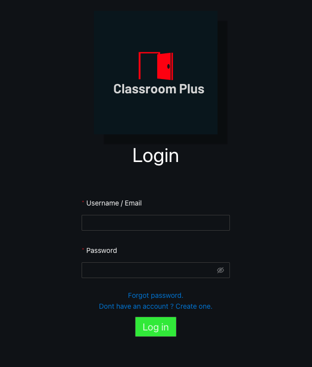
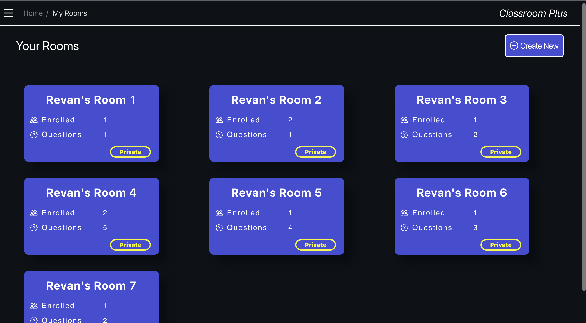
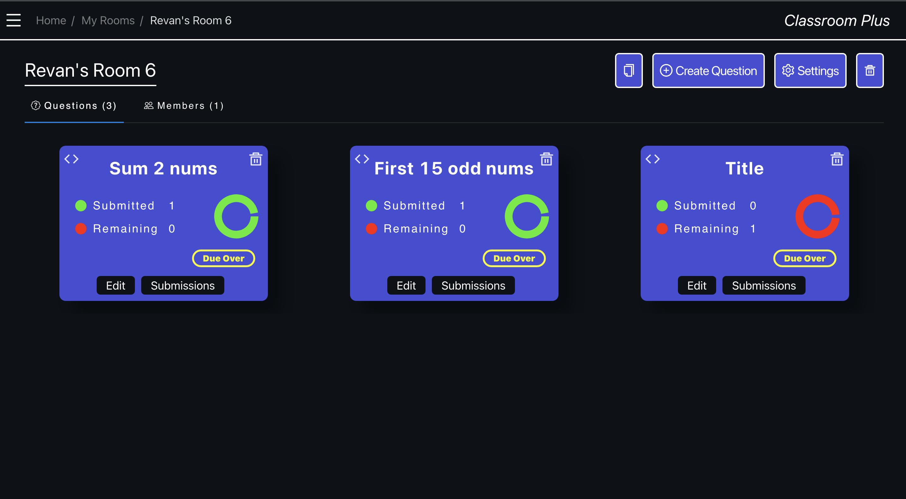
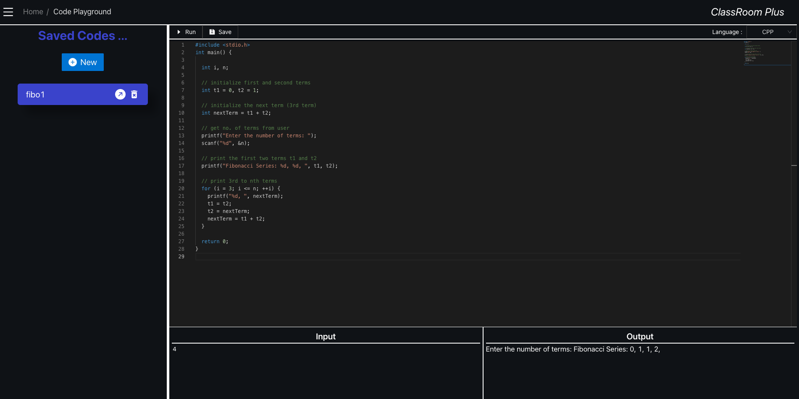
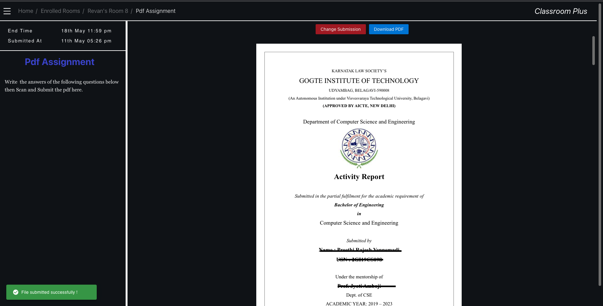
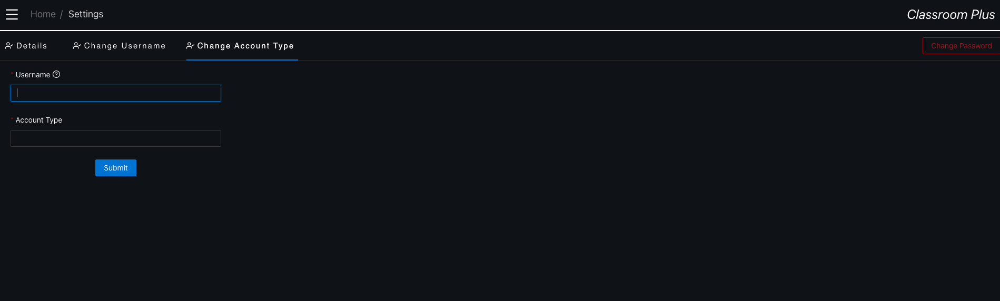
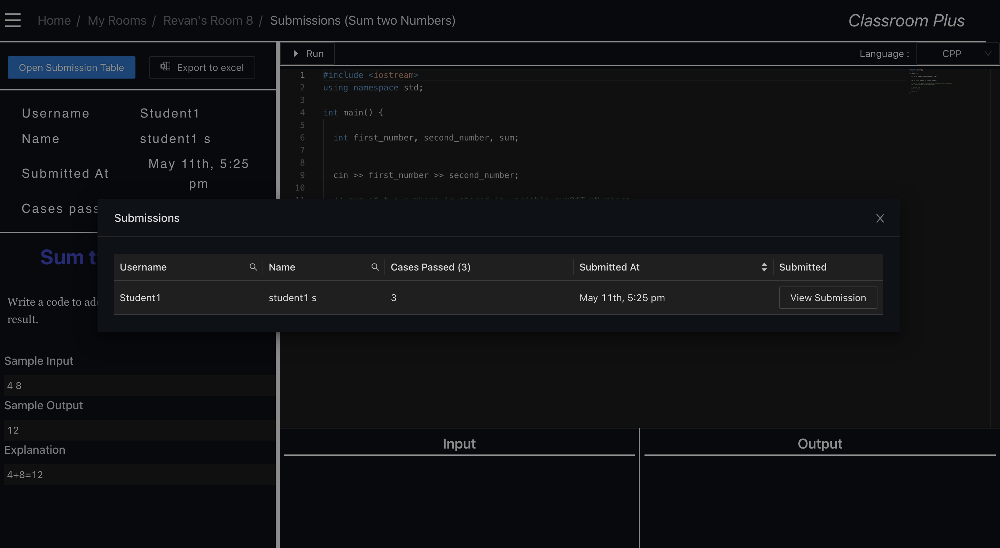

# Classroom Plus
Classroom Plus is a user-friendly learning platform system designed to simplify coding and file type assignment management for educational institutions. The project aims to streamline the process of creating, distributing, and grading assignments while enhancing security and user experience.

## Features
1. Assignment Management: Simplifies the process of creating, distributing, and grading assignments.
2. Code Editor: Includes a code editor for coding questions, making it convenient for both students and instructors.
3. Security Enhancement: Implements a "waiting room" feature to authenticate student access and ensures secure enrollment.
4. Private Enrollment Links: Introduces private student enrollment links to classrooms, enhancing privacy and accessibility.

## Technologies Used
Frontend: React, Redux
Backend: FastAPI
Database: SQLite
Version Control: Git

## Screenshots:

### Login page

### Classroom List page

### Assignment Status page

### Code Editor page

### Setting coding assignment page

### File type assignment submission page

### Account type page

### Coding Assignment Submission page

